# Habit Wallet Lite

[](https://github.com/YOUR_USERNAME/habit_wallet_lite/actions)

A simple, offline-first personal finance manager (PFM) built with Flutter.

## Features
-   **Dashboard**: Monthly spending chart (Bar Chart) and recent transactions list.
-   **Transactions**: Add/Edit/View expenses and incomes with categories, notes, and dates.
-   **Offline-First**: Uses `drift` (SQLite) for local storage. Data is always available.
-   **Sync**: Background sync stub (simulated API calls) with conflict resolution logic (Last-Write-Wins).
-   **Auth**: Simple PIN-based authentication (Stub: '1234').
-   **Internationalization**: Support for English and Tamil.
-   **Notifications**: Daily reminder at 8 PM to log expenses.
-   **Deep Linking**: Open specific transactions via `app://tx/{id}`.
-   **Theming**: Light and Dark mode support.

## Architecture

This project follows **Clean Architecture** principles:

```mermaid
graph TB
    subgraph Presentation["🎨 Presentation Layer"]
        UI[Pages & Widgets]
        Router[GoRouter Navigation]
        Providers[Riverpod Providers]
    end
    
    subgraph Domain["💼 Domain Layer"]
        Entities[Entities<br/>Transaction, Category]
        UseCases[Use Cases<br/>GetTransactions<br/>AddTransaction<br/>UpdateTransaction]
        RepoInterface[Repository Interfaces]
    end
    
    subgraph Data["📦 Data Layer"]
        RepoImpl[Repository<br/>Implementations]
        LocalDS[Local DataSource<br/>Drift SQLite]
        RemoteDS[Remote DataSource<br/>MockApiService]
    end
    
    UI --> Providers
    Providers --> UseCases
    UseCases --> RepoInterface
    RepoImpl -.implements.- RepoInterface
    RepoImpl --> LocalDS
    RepoImpl --> RemoteDS

    style Presentation fill:#e1f5ff
    style Domain fill:#fff3e0
    style Data fill:#f3e5f5
```



### Layer Responsibilities

- **Presentation**: UI (Widgets, Pages), State Management (Riverpod), Navigation (GoRouter)
- **Domain**: Business Logic (Use Cases, Entities, Repository Interfaces)
- **Data**: Data Sources (Drift DB, Mock API), Repository Implementations, Mappers

### Tech Stack
-   **Flutter**: UI Framework (SDK 3.7.0)
-   **Riverpod**: State Management & DI
-   **Drift**: Local Database (SQLite)
-   **GoRouter**: Navigation & Deep Linking
-   **Freezed**: Immutable Data Classes
-   **FL Chart**: Chart Visualization
-   **flutter_local_notifications**: Daily Reminders

## Setup

1.  **Prerequisites**: Flutter SDK 3.7+, Android Device/Emulator.
2.  **Install Dependencies**:
    ```bash
    flutter pub get
    ```
3.  **Generate Code** (Freezed, Riverpod, Drift):
    ```bash
    dart run build_runner build --delete-conflicting-outputs
    # Or use the provided script on Windows:
    .\\gen.bat
    ```
4.  **Run**:
    ```bash
    flutter run
    ```

5.  **Run Tests**:
    ```bash
    flutter test --coverage
    ```

## Tradeoffs & Design Decisions

### Stubbed Features
-   **Sync**: Fully functional local DB, but remote sync is simulated (`MockApiService`). In a real app, this would connect to a REST/GraphQL endpoint with proper authentication.
-   **Auth**: PIN verification is local-only stub. Secure storage is used, but a real auth flow would involve tokens, biometrics, and session management.
-   **Attachments**: UI is present, but file picking logic is a stub due to "Lite" scope constraints. Would integrate `file_picker` package + cloud storage in production.

### Conflict Resolution
-   **Strategy**: Last-Write-Wins (LWW) for simplicity
-   **Implementation**: When updating a previously synced transaction, the `editedLocally` flag is set to `true`, indicating local modifications
-   **Trade-off**: In production, would implement CRDT or vector clocks for better conflict resolution

### Performance Optimizations
-   **LazyDatabase**: Defers database connection until first use (faster cold start)
-   **List Virtualization**: `ListView.builder` for efficient scrolling of long lists
-   **Chart Optimization**: FL Chart limited to 31-day monthly data, preventing performance degradation

## Profiling Notes

> **Note**: Run profiling on physical device for accurate metrics

### Startup Performance
- **Cold Start**: [Measure with `flutter run --profile --trace-startup`]
- **Warm Start**: [Measure with subsequent launches]
- **Optimization**: LazyDatabase defers DB initialization, reducing startup overhead

### Jank Analysis
- **Target**: ≤1% jank on mid-range device (4GB RAM)
- **Method**: Use Flutter DevTools Performance tab
- **Command**: `flutter run --profile` → Open DevTools → Timeline
- **Optimizations**:
  - ListView.builder for virtualized scrolling
  - FL Chart renders only visible data points
  - Riverpod caching prevents unnecessary rebuilds

### APK Size
- **Debug APK**: ~[XX] MB
- **Release APK**: ~[XX] MB (measured with `flutter build apk --release`)
- **Optimization**: R8/Proguard enabled for code shrinking and obfuscation

### Performance Testing Steps
```bash
# 1. Profile startup
flutter run --profile --trace-startup --trace-startup-output=startup_trace.json

# 2. Build release APK and measure size
flutter build apk --release
# Check: build/app/outputs/flutter-apk/app-release.apk

# 3. Test on physical device
flutter run --profile
# Open DevTools → Performance → Record scrolling timeline
```

## Testing

### Test Coverage
-   **Unit Tests**: Use cases, entities, mock API service
-   **Widget Tests**: Dashboard screen, PIN screen
-   **Target Coverage**: ≥60% for business logic modules

### Running Tests
```bash
# Run all tests with coverage
flutter test --coverage

# Run specific test file
flutter test test/domain/usecases/get_transactions_test.dart

# View coverage report (requires lcov)
genhtml coverage/lcov.info -o coverage/html
open coverage/html/index.html
```

## CI/CD

GitHub Actions workflow automatically runs on every push:
1. ✅ `flutter analyze` - Linting (0 warnings required)
2. ✅ `flutter test --coverage` - Unit & Widget Tests
3. ✅ `flutter build apk --debug` - Build verification

## Time Tracking

**Estimated Time Spent**: [TO BE FILLED]
- Architecture Setup: [X] hours
- Feature Implementation: [X] hours
- Testing: [X] hours
- Documentation: [X] hours
- CI/CD Setup: [X] hours
- Bug Fixes & Refinement: [X] hours

**Total**: ~[XX] hours

## Future Improvements (With 1 Extra Day)

Given one additional day, I would prioritize:

1. **Real Backend Integration** (4 hours)
   - Replace MockApiService with actual REST API
   - Implement proper JWT authentication
   - Add retry logic and offline queue for sync

2. **Enhanced Testing** (2 hours)
   - Increase coverage to 80%+
   - Add integration tests for critical flows
   - Add golden tests for UI consistency

3. **Advanced Features** (2 hours)
   - Recurring transactions (subscriptions, bills)
   - Budget tracking with notifications
   - Export to CSV/PDF

## Device Testing

**Primary Device**: V2311 (4GB RAM, Android [VERSION])
- ✅ All features tested and working
- ✅ Smooth scrolling (no jank observed)
- ✅ Deep links working
- ✅ Notifications triggering at 8 PM

## License

This project is for interview demonstration purposes.
